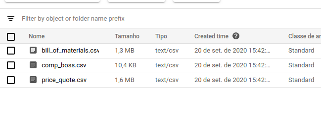

# ETL de arquivos CSV em arquitetura GCP

## Introdução
Este projeto visa o desenvolvimento de um job ETL para 3 arquivos CSV, usando a GCP (_Google Cloud Platform_).

A arquitetura adotada foi a mais simples, direta e baixo custo possível.

__Custos para implementar: R$0,00.__

A arquitetura adotada atende o cenário proposto, uma vez que o problema não especifica a frequência de atualização dos dados, meios de acesso ou Views especificas para os relatórios. Caso o cenário seja diferente, uma outra arquitetura deveria ser usada.

## Análise das Tabelas

### Entidades
- comp_boss.csv --> COMPONENT
- bill_of_materials.csv --> TUBE_ASSEMBLY
- price_quote.csv --> PRICE_QUOTE

### Tratamentos necessários
- Limpar os valores NA
- Booleanos podem ser tratados como Int (0 e 1)
- Converter os DataTypes
- bill_of_materials.csv: Transformar as colunas de componente e quantidade em rows (pivotar).

### Observações da Data Analysis
- bill_of_materials.csv: Existem situações que o "tube_assembly_id" não tem componentes (e.g.: TA-00019)
- Alguns component_ids do bill_of_materials.csv não existem dentro da comp_boss.csv
- Valores como 9999 e NA foram considerados como NaN/Null uma vez que fogem muito do padrão. Em situações do cotidiano isto seria confirmado com outros times.
- Tem situações em que existem 2 valores para a mesma cota, porém o que varia é a quote_date e as vezes o supplier. Nestes casos acredito que ocorreram atualizações de preço, e o valor com a data anterior não é considerado mais. Seria bom ter uma confirmação sobre este comportamento. (e.g. TA-00034)

### Diagrama

## Arquitetura

A arquitetura proposta é composta por 4 produtos do GCP: ___Cloud Scheduler, Cloud Functions, Cloud Storage e Data Studio___

1. O Scheduler dispara a execução do Functions que contém o código do ETL
2. O ETL extrai os dados CSV do Storage e aplica os tratamentos necessários
3. Por fim, o ETL salva estes dados no Bucket refined
4. Relatórios do DataStudio estão lendo os arquivos do Bucket refined.

### Cloud Scheduler

Agendador de tarefa programado para executar todo o dia as 00h00m

#### Agendador:

### Cloud Functions

Produto FaaS (Function as a Service) do GCP. Em nossa arquitetura criamos o método de ETL neste componente, e que recebeu o nome de ***ETL_bill_of_materials***. O mesmo é disparado tanto por requisições Http quanto pelo trigger do Cloud Scheduler.

#### Function ETL:

### Cloud Storage

Produto do GCP onde se cria buckets para manter os arquivos (Blobs). Em nossa arquitetura criamos 2 buckets: 
- /raw --> Contém os arquivos Raw de input
- /refined --> Diretório usado para gravar os dados 

#### Bucket:

#### Bucket Raw:

#### Bucket Refined:

### Data Studio

Ambiente para criação de Relatóriso e Visualizações. Os 3 arquivos que estão no Bucket de Refined foram usados como Origem de Dados para as visualizações.

Obs: Estes relatórios são bem simples apenas para mostrar o conceito. Para visualizações mais avançadas seria necessário criar views mais detalhadas.

#### Relatório:

## Melhorias
- Acrescentar Big Query para criar views mais detalhadas
- Acrescentar o Google Cloud Composer para Orquestração do pipeline
- Caso atualização dos dados seja constante, uma sugestão é usar o Google Cloud Run que possui um preço melhor do que o Functions para execuções mais longas

